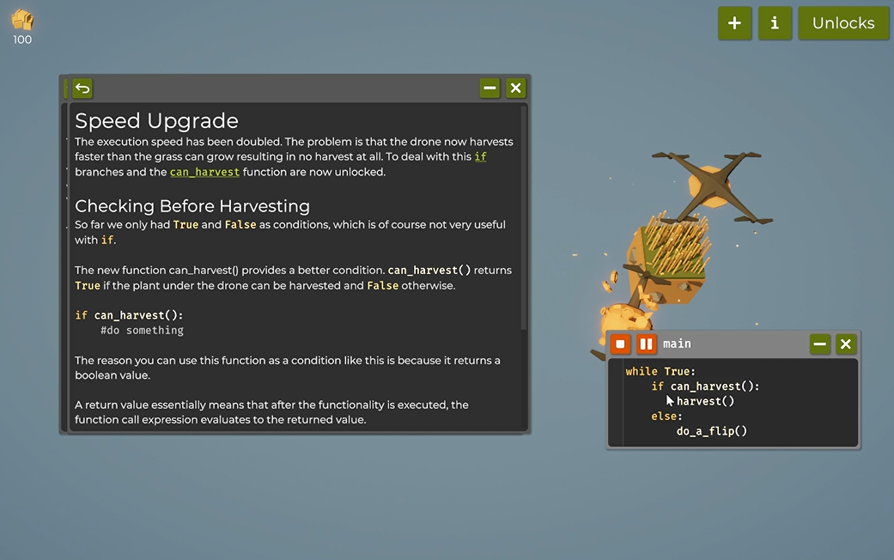
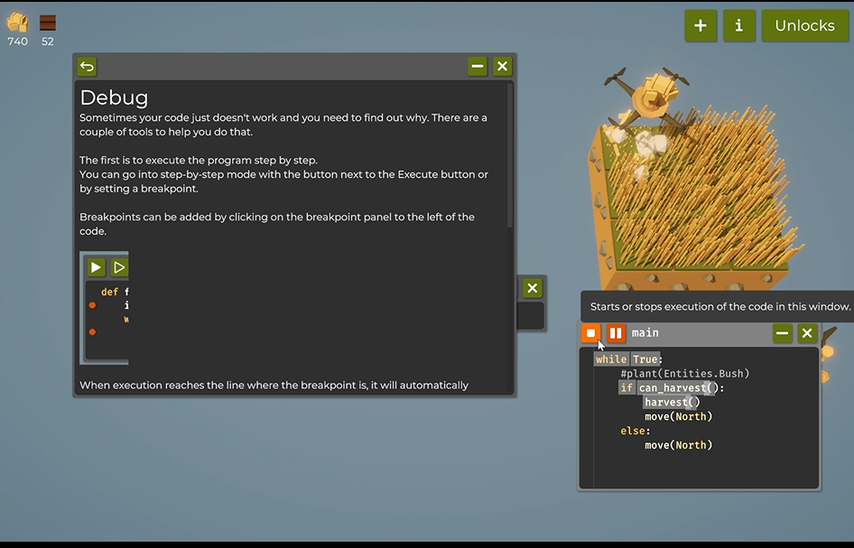
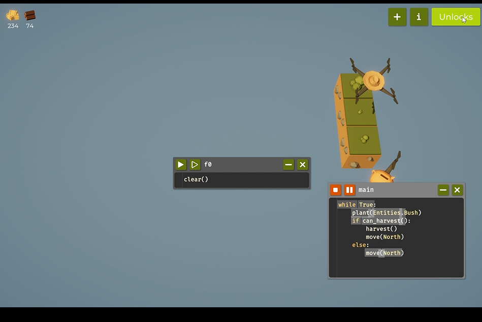
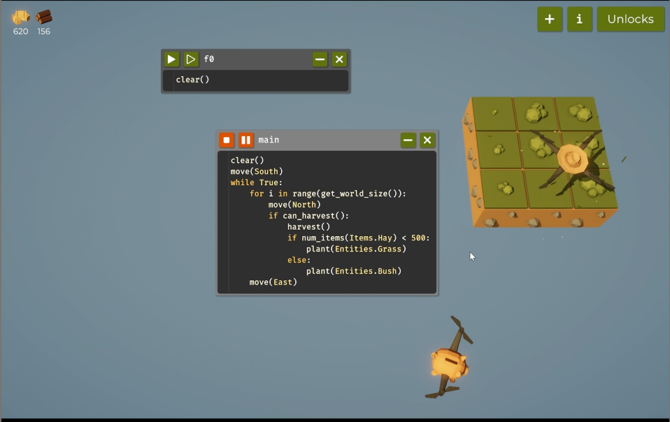
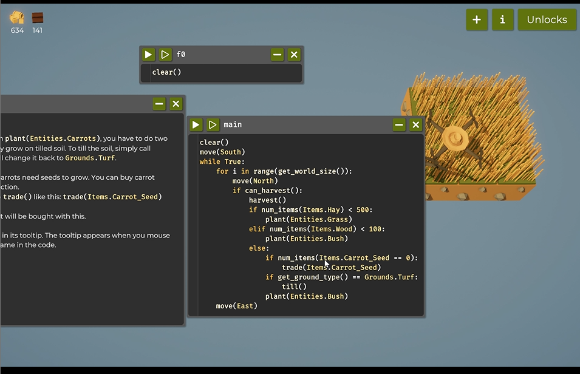

# Programming the Farming Drone (Report)

# SWE_CAP2_Game_Automation

## *INTRODUCTION*
"The Farmer Was Replaced" revolves around solving logic-based puzzles where the player must code the actions of a robot farmer. The objective is to complete various farming tasks by writing and debugging code that controls the robot's movements and actions. Each level presents new challenges and complexities, requiring players to think critically and improve their programming skills. It's an excellent way to learn programming concepts in a fun and engaging manner.


**Key Features**

- **Programming Language**: The game employs a Python-like programming language designed to be intuitive and easy to learn, making it accessible for beginners and convenient for more experienced users.

- **Automation**: Players can program drones to perform agricultural tasks, such as planting, watering, and harvesting crops, adding a hands-off, efficient approach to farming.

- **Resource Management**: Completing farming tasks earns resources that can be used to unlock new technology and upgrades, allowing players to advance in the game.

- **Progressive Learning**: The game introduces programming concepts progressively, starting with basic ideas and advancing to more complex tasks. This gradual learning curve is ideal for players of all programming levels.

- **Early Access**: Currently in Early Access, the game is still in development. Players have the opportunity to provide feedback, helping to shape the final release.

**Gameplay**

- **Code Editor**: The game includes a code editor with helpful features like autocomplete and syntax highlighting, making it easier to write, test, and debug code.

- **Challenges**: Each level introduces new challenges, encouraging players to develop their programming skills and think critically to overcome various obstacles.

- **Automation Execution**: After coding, players can press “execute” to see their drones perform tasks automatically, giving them a sense of achievement as their code comes to life.

- **Leaderboards**: A competitive edge is added with leaderboards that track the fastest automation runs, motivating players to optimize their code and achieve top rankings.


By engaging with these objectives, I develop skills in balancing efficiency, resource management, and algorithmic problem-solving. The gameplay requires careful consideration of optimizing resource use while addressing the specific growth requirements and characteristics of a diverse range of crops. This process involves systematically evaluating strategies to maximize output and minimize resource expenditure, fostering a deeper understanding of computational efficiency and strategic planning within a dynamic, agricultural context.
# Table of Contents
- [Code Snippets and Explanation](#code-snippets-and-explanation)
- [Challenges and Learnings](#challenges-and-learnings)
- [References](#references)

# Code-Snippets-and-Explanation

## Step 1: Farming on 1 tile
### *Code:*

.png)
```
harvest()
````
### *Explanation:*

The code runs and collects grass upto 5 and then the loops get unlocked

### *Demo:*



### *Code:*

````python
while True:
    if can_harvest():
        harvest()
    else:
        do_a_flip()
````                      
*Explanation:*

The drone continuously monitors its surroundings, ready to harvest grass whenever the conditions are right. If the conditions for harvesting are met, it gets to work, cutting the grass efficiently. But if those conditions aren’t met, the drone takes a moment to perform a quick flip before getting back to scanning and continuing the harvest process. This cycle repeats, with the drone always ready to check, harvest, or perform its flip, as needed.
### *Code:*

```python
while True:
    if can_harvest():
        harvest()
        move(North)
```
### *Explanation:*

After unlocking the expand tiles,we expand it to 3 x 1 then while harvesting we can move north and continue harvesting.


### *Code:*
````python
clear()
````
```python
while True:
	plant(Entities.Bush)
	if can_harvest():
		harvest()
		move(North)
	else:
		move(North)
```
### *Explanation:*
Firstly, to plant a bush, i created new window and name this clear and its goin to simply clear the function and its goint to reset everything.
Uisng this code, we plant bush which is one of the entities and harvest both wood and grass alternately, unfortunately while coding the below code ;
```python
 while True:
	plant(Entities.Bush)
	if can_harvest():
		harvest()
		move(North)
```
the problem i faced is that the drone doesn't move on even through the bushes and take much longer to grow.


### *Notes:*
* I expand and the tiles got expanded to 1 x 3 from 1 x 1.
* I upgraded the grass so that I can increase the yield of the grass.and also 
* I unlocked speed of the drone so that I can harvest more with the intense speed.
* I unlocked the senses which gives us a whole bunch of commands to analyze the surrounding and certain states of the drone.
* I unlocked the operaters
* I unlocked the debug 


## Step 2: Farming on 3 x 3 tile

### *Code:*

```python
clear()
move(South)
while True:
	for i in range(get_world_size()):
		move(North)
		if can_harvest():
			harvest()
			if num_items(Items.Hay) < 500:
				plant(Entities.Grass)
			else:
				plant(Entities.Bush)
	
	move(East)
```

### *Explanation:*

Now I have 3 x 3 farming tile so now I have also unlocked the loops so that it can run for infinite times setting the conditions. In this code I have set my drone to move 3 tiles to north and 3 tiles to east in my farming size which I called using get_world_size() function. What I did is that I will check if my hay is less than 500 or not and it is less than 500 then drone plants the entities grass and if it is greater than 500, it starts plantiing bushes for wood. I have used clear() and move(South) to clear all the states to starting position and after moving to 3 tiles north and return to south and again continue harvesting respectively.


### *Code:*
```python
clear()
move(South)
while True:
	for i in range(get_world_size()):
		move(North)
		if can_harvest():
			harvest()
			if num_items(Items.Hay) < 600:
				plant(Entities.Grass)
			elif num_items(Items.Wood) < 400:
				plant(Entities.Bush)
			else:
				if num_items(Items.Carrot_Seed) == 0:
					trade(Items.Carrot_Seed)
				if get_ground_type() == Grounds.Turf:
					till()
				plant(Entities.Carrots)
	
	move(East)
```

### *Explanation:*

When I execute this code, it checks the number of items I have by looking at the conditions I set and then it also checks if I have Carrot_Seeds and if I don't have the Carrot_Seeds then it trades using the trade() funtion. After trading the Carrot_Seeds before planning the Carrots it checks if the ground is tilled or not by using the get_ground_type() function and then only plants the carrots.

### *Code:*

```python
clear()
move(South)
while True:
	for i in range(get_world_size()):
		move(North)
		if can_harvest():
			#Harvest
			harvest()
			
			#Water Tank
			if num_items(Items.Water_Tank) < 100:
				trade(Items.Empty_Tank)
			#watering
			if get_water() < 0.75: #(b/w 0 - 1)
				use_item(Items.Water_Tank)
			#Hay
			if num_items(Items.Hay) < 600:
				if get_ground_type() == Grounds.Soil:
					till()
				plant(Entities.Grass)
			#Wood
			elif num_items(Items.Wood) < 400:
				if get_ground_type() == Grounds.Soil:
					till()
				plant(Entities.Bush)
			#Carrots
			else:
				if num_items(Items.Carrot_Seed) == 0:
					trade(Items.Carrot_Seed)
				if get_ground_type() == Grounds.Turf:
					till()
				plant(Entities.Carrots)
	
	move(East)
```

### *Explanation:*

In the watering part of the code, the character ensures it has enough filled water tanks and maintains an optimal water level for crops. First, it checks if the inventory contains fewer than 100 water tanks using num_items(Items.Water_Tank) < 100. If so, it calls trade(Items.Empty_Tank), likely to acquire more water tanks or refill them. Then, the code checks the current water level with if get_water() < 0.75, and if the water level is below 75% (on a scale of 0 to 1), it uses one of the filled water tanks by calling use_item(Items.Water_Tank). This keeps the crops adequately watered without wasting resources, as water tanks are only used when the level drops below the set threshold.

### *Code:*
```python
clear()
move(South)
#variables
WatertankCap = 100
HayCap = 500
WoodCap = 300
CarrotCap = 100
#main loop
while True:
	for i in range(get_world_size()):
		move(North)
		if can_harvest():
			#Harvest
			harvest()
			
			#Water Tank
			if num_items(Items.Water_Tank) < WatertankCap:
				trade(Items.Empty_Tank)
			#watering
			if get_water() < 0.75: #(b/w 0 - 1)
				use_item(Items.Water_Tank)
			#Hay
			if num_items(Items.Hay) < HayCap:
				if get_ground_type() == Grounds.Soil:
					till()
				plant(Entities.Grass)
			#Wood
			elif num_items(Items.Wood) < WoodCap:
				if get_ground_type() == Grounds.Soil:
					till()
				plant(Entities.Bush)
			#Carrots
			elif num_items(Items.Carrot) < CarrotCap:
				if num_items(Items.Carrot_Seed) == 0:
					trade(Items.Carrot_Seed)
				if get_ground_type() == Grounds.Turf:
					till()
				plant(Entities.Carrots)
	
	move(East)
```

### *Explanation:*

In this code I used the variables to give the values of the items i want to harvest
### *Note:*
* I unlocked the carrots since i got enough woods and grasses to till the soil and purchase the seeds.
* I unlocked the operators which is very important unlock.
* i unlocked for loop which is very important.
* I unlocked the variables now that I can set the number of entities I want to keep as a condition.
* I Unlocked the watering so that i get access to new items , the empty tank that is going to fill itself .


## Step 4: Farming on 4 x 4 tile
 ### *Code:*
 ````python
clear()
move(South)
#variables
WatertankCap = 100
HayCap = 750
WoodCap = 500
CarrotCap = 200
#main loop
while True:
	for i in range(get_world_size()):
		move(North)
		x = get_pos_x()
		y = get_pos_y()
		if can_harvest():
			#Harvest
			harvest()
			
			#Water Tank
			if num_items(Items.Water_Tank) < WatertankCap:
				trade(Items.Empty_Tank)
				
			#watering
			if get_water() < 0.75: #(b/w 0 - 1)
				use_item(Items.Water_Tank)
				
			#Hay
			if num_items(Items.Hay) < HayCap:
				if get_ground_type() == Grounds.Soil:
					till()
				plant(Entities.Grass)
				
			#Wood
			elif num_items(Items.Wood) < WoodCap:
				if (x % 2 == 0 and y % 2 == 1) or (x % 2 == 1 and y % 2 == 0):
					plant(Entities.Tree)
				else:
					if get_ground_type() == Grounds.Soil:
						till()
					plant(Entities.Bush)
	
			#Carrots
			elif num_items(Items.Carrot) < CarrotCap:
				if num_items(Items.Carrot_Seed) == 0:
					trade(Items.Carrot_Seed)
				if get_ground_type() == Grounds.Turf:
					till()
				plant(Entities.Carrots)
	
	move(East)
````

### *Explanation:*

In this code I wrote the code to plant trees so that we can increase the yield of the woods and here I needed to plant trees in checkerboard pattern so that trees can grow well. For that I used the get_pos_x and get_pos_y functions to get the positions where I can plant the trees where the positions are odd so that its position remain in checkerboard pattern.


### *Code:*
*Main*
````python
clear()
move(South)
##variables
WatertankCap = 100
HayCap = 6000
WoodCap = 2000
CarrotCap = 1500
##main loop
while True:
	for i in range(get_world_size()):
		move(North)
		x = get_pos_x()
		y = get_pos_y()
		if can_harvest():
			
			##Harvest
			harvest()
			
			##Watering
			watering()
			
			##Planting
			planting()
			
				
	#Next Row
	move(East)


*Planting Function*
python
def planting():
	#Hay
	if num_items(Items.Hay) < HayCap:
		if get_ground_type() == Grounds.Soil:
			till()
		plant(Entities.Grass)
				
	#Wood
	elif num_items(Items.Wood) < WoodCap:
		if (x % 2 == 0 and y % 2 == 1) or (x % 2 == 1 and y % 2 == 0):
			plant(Entities.Tree)
		else:
			if get_ground_type() == Grounds.Soil:
				till()
			plant(Entities.Bush)
	
	#Carrots
	elif num_items(Items.Carrot) < CarrotCap:
		if num_items(Items.Carrot_Seed) == 0:
			trade(Items.Carrot_Seed, 5)
		if get_ground_type() == Grounds.Turf:
			till()
		plant(Entities.Carrots)


*Watering Function*
python
def watering():
		#Water Tank
		if num_items(Items.Water_Tank) < WatertankCap:
			trade(Items.Empty_Tank, 5)
		#watering
		if get_water() < 0.75: #(b/w 0 - 1)
			use_item(Items.Water_Tank)
````

### *Explanation:*

Unlocking the functions, I created a seperate windows for each function such as main, planting and the watering functions. After that, I called the functions of planting and watering in the main function. Multi-trade helped me trade more Carrot_seeds and Empty_Tank at a time and here I tarded for 5 using this line of codes trade(Items.Empty_Tank, 5) and trade(Items.Carrot_Seed, 5).


### *Code:*
````python
clear()
do_a_flip()
move(South)
#variables
WatertankCap = 100
HayCap = 10000
num_wood = 6000
CarrotCap = 5000
PumpkinCap = 600
#main loop
while True:
	for i in range(get_world_size()):
		move(North)
		x = get_pos_x()
		y = get_pos_y()
		if can_harvest():
			
			#Harvest
			harvest()
			
			#Watering
			watering()
			
			#Planting
			planting()
		else:
			if get_ground_type() == Grounds.Soil:
				till()
				
	#Next Row
	move(East)

*Planting Functions*
python
def planting():
	#Sunflower
	if x == 0 and y == 0:
		if num_items(Items.Sunflower_Seed) == 0:
			trade(Items.Sunflower_Seed, 5)
		if get_ground_type() == Grounds.Turf:
			till()
		plant(Entities.Sunflower)
		
	#Hay
	elif num_items(Items.Hay) < HayCap:
		if get_ground_type() == Grounds.Soil:
			till()
		plant(Entities.Grass)
				
	#Wood
	elif num_items(Items.Wood) < WoodCap:
		if (x % 2 == 0 and y % 2 == 1) or (x % 2 == 1 and y % 2 == 0):
			plant(Entities.Tree)
		else:
			if get_ground_type() == Grounds.Soil:
				till()
			plant(Entities.Bush)
	
	#Carrots
	elif num_items(Items.Carrot) < CarrotsCap:
		if num_items(Items.Carrot_Seed) == 0:
			trade(Items.Carrot_Seed, 5)
		if get_ground_type() == Grounds.Turf:
			till()
		plant(Entities.Carrots)
		
	
	#Pumpkins
	elif num_items(Items.Pumpkin) < PumpkinCap:
		if num_items(Items.Pumpkin_Seed) == 0:
			trade(Items.Pumpkin_Seed, 5)
		if get_ground_type() == Grounds.Turf:
			till()
		plant(Entities.Pumpkin)
````
### *Explanation:*
I have unlocked a new function called measure, so whenever the drone is above a petal, we can measure the amount of petals because here I need to harvest the sunflower with the most petals to get more power which helps in harvesting faster.
#### Plantation of Sunflower:
- Sunflowers are set to be planted at a designated starting position (x == 0 and y == 0), indicating that they may be grown in a fixed location, possibly as a decorative crop or one that has special requirements.

- The code checks if sunflower seeds are available (num_items(Items.Sunflower_Seed) == 0). If not, it trades for 5 more seeds.

- Then, if the ground is turf, it uses till() to prepare the soil, ensuring that the sunflower has an optimal growth environment.

- Finally, it plants the sunflower using plant(Entities.Sunflower), maintaining the inventory and growth cycle for this specific crop.

### Plantation of Pumpkin:
- The pumpkin planting section checks if the inventory of harvested pumpkins is below the required amount (num_items(Items.Pumpkin) < num_pumpkins).

- If the pumpkin seed inventory is empty, it trades for more seeds to prevent any planting delays.

- Similar to sunflowers, it checks if the ground type is turf, tills the soil if necessary, and then plants the pumpkin using plant(Entities.Pumpkin).

From this approach I can ensure that both sunflowers and pumpkins are planted only when conditions are ideal, keeping their production consistent with game objectives, which likely involve managing resources efficiently and meeting specific crop threshold I set.


### *Note:*
* I unlocked the Tree function
* I can define new function using def keyword 



## Step 5: Farming on 5 x 5 tile

### *Code:*
````python
clear()
do_a_flip()
move(South)
#variables
WatertankCap = 100
HayCap = 6000
WoodCap = 2000
CarrotCap = 1500
PumpkinCap = 500
#main loop
while True:
	for i in range(get_world_size()):
		move(North)
		x = get_pos_x()
		y = get_pos_y()
		if can_harvest():
			
			#Harvest
			harvest()
			
			#Watering
			watering()
			
			#Planting
			planting()
		else:
			if get_ground_type() == Grounds.Soil:
				till()
				
	#Next Row
	move(East)


def planting():
	#Sunflower
	if x == 0 and y == 0:
		if num_items(Items.Sunflower_Seed) == 0:
			trade(Items.Sunflower_Seed, 5)
		if get_ground_type() == Grounds.Turf:
			till()
		plant(Entities.Sunflower)
		
	#Hay
	elif num_items(Items.Hay) < HayCap:
		if get_ground_type() == Grounds.Soil:
			till()
		plant(Entities.Grass)
				
	#Wood
	elif num_items(Items.Wood) < WoodCap:
		if (x % 2 == 0 and y % 2 == 1) or (x % 2 == 1 and y % 2 == 0):
			plant(Entities.Tree)
		else:
			if get_ground_type() == Grounds.Soil:
				till()
			plant(Entities.Bush)
	
	#Carrots
	elif num_items(Items.Carrot) < CarrotCap:
		if num_items(Items.Carrot_Seed) == 0:
			trade(Items.Carrot_Seed, 5)
		if get_ground_type() == Grounds.Turf:
			till()
		plant(Entities.Carrots)
		
	
	#Pumpkins
	elif num_items(Items.Pumpkin) < PumpkinCap:
		if num_items(Items.Pumpkin_Seed) == 0:
			trade(Items.Pumpkin_Seed, 5)
		if get_ground_type() == Grounds.Turf:
			till()
		plant(Entities.Pumpkin)


def watering():
		#Water Tank
		if num_items(Items.Water_Tank) < WatertankCap:
			trade(Items.Empty_Tank, 5)
		#watering
		if get_water() < 0.75:
			use_item(Items.Water_Tank)
````

### *Note:*
The codes were as same as previous one .


## Step 6: Farming on 6 x 6 tile

### *Code:*
````python
clear()
do_a_flip()
move(South)
#variables
WatertankCap = 100
HayCap = 6000
WoodCap = 2000
CarrotCap = 2500
PumpkinCap = 500

#main loop
while True:
	for i in range(get_world_size()):
		#buy stuff
		if num_items(Items.Sunflower_Seed) < 100:
			trade(Items.Sunflower_Seed, get_world_size())
		if num_items(Items.Carrot_Seed) < 100:
			trade(Items.Carrot_Seed, get_world_size())
		if num_items(Items.Pumpkin_Seed) < 100:
			trade(Items.Pumpkin_Seed, get_world_size())
			
		move(North)
		x = get_pos_x()
		y = get_pos_y()
		if can_harvest():
			
			#Harvest
			harvest()
			
			#Watering
			watering()
			
			#Planting
			planting()
		else:
			if get_ground_type() == Grounds.Soil:
				till()


def planting():
	#Sunflower
	if x == 0 and y == 0:
		if num_items(Items.Sunflower_Seed) == 0:
			trade(Items.Sunflower_Seed, 5)
		if get_ground_type() == Grounds.Turf:
			till()
		plant(Entities.Sunflower)
		
	#Hay
	elif num_items(Items.Hay) < HayCap:
		if get_ground_type() == Grounds.Soil:
			till()
		plant(Entities.Grass)
				
	#Wood
	elif num_items(Items.Wood) < WoodCap:
		if (x % 2 == 0 and y % 2 == 1) or (x % 2 == 1 and y % 2 == 0):
			plant(Entities.Tree)
		else:
			if get_ground_type() == Grounds.Soil:
				till()
			plant(Entities.Bush)
	
	#Carrots
	elif num_items(Items.Carrot) < CarrotCap:
		if num_items(Items.Carrot_Seed) == 0:
			trade(Items.Carrot_Seed, 5)
		if get_ground_type() == Grounds.Turf:
			till()
		plant(Entities.Carrots)
		
	
	#Pumpkins
	elif num_items(Items.Pumpkin) < PumpkinCap:
		if num_items(Items.Pumpkin_Seed) == 0:
			trade(Items.Pumpkin_Seed, 5)
		if get_ground_type() == Grounds.Turf:
			till()
		plant(Entities.Pumpkin)

    def watering():
		#Water Tank
		if num_items(Items.Water_Tank) < WatertankCap:
			trade(Items.Empty_Tank, 5)
		#watering
		if get_water() < 0.75: 
			use_item(Items.Water_Tank)
````

### *Explanation:*

* To ensure a smooth and efficient planting process on my farm, I added an automated system to manage seed purchases for sunflowers, carrots, and pumpkins. Now, whenever my inventory has fewer than 100 of any seed type, the code automatically trades for more. I also used the `get_world_size()` function to adjust the amount of seeds I buy based on the farm's size, which means the purchase is scaled to the specific area I'm managing.

* This setup guarantees that I always have enough seeds to keep the planting process going without interruptions. It also prevents my inventory from getting overloaded, allowing me to balance resources effectively. With this system in place, I can shift my focus to optimizing other areas of my farm, knowing that my seed supply is reliably managed.

### *Note:*

- I  upgraded the level for tree, Grass and Bush which helped a lot in increasing the yield for hay, wood.
- I also upgraded the speed which helped me in harvesting fast. 
- Now that I harvested enough woods and carrots i can expand my tiles to 7 x 7.


## Step 7: Farming on 7 x 7 tile

### *Code:*
````python
clear()
do_a_flip()
move(South)

# variables
WatertankCap = 100
HayCap = 20000
WoodCap = 20000
CarrotCap = 5000
PumpkinCap = 20000


pedalList = list()
# Main loop
while True:
	for i in range(get_world_size()):
		# Buy seeds if needed
		if num_items(Items.Sunflower_Seed) < 100:
			trade(Items.Sunflower_Seed, get_world_size())
		if num_items(Items.Carrot_Seed) < 100:
			trade(Items.Carrot_Seed, get_world_size())
		if num_items(Items.Pumpkin_Seed) < 100:
			trade(Items.Pumpkin_Seed, get_world_size())
			
		move(North)
		x = get_pos_x()
		y = get_pos_y()

		# Harvest Sunflowers
		if can_harvest():
			if get_entity_type() == Entities.Sunflower:
				if measure() == max(pedalList):
					harvest()
					pedalList.remove(max(pedalList))
			else:
				# Harvest, Water, and Plant
				harvest()
				watering()
				planting()
		else:
			if get_ground_type() == Grounds.Soil:
				till()
				
	# Move to the next row
	move(East)
````

### *Explanaton:*

In this part of the code, I used `pedalList` as a way to monitor the growth of my sunflowers. Every time I plant a sunflower, I immediately measure its growth using `measure()` and add that data to `pedalList`. This gives me a real-time view of each sunflower’s progress, helping me easily identify which ones are ready for harvesting.

When it’s time to harvest, I only pick a sunflower if its growth level matches the highest value in `pedalList`, ensuring it’s one of the most mature in the field. Once harvested, I remove its measurement from `pedalList`, keeping the list accurate for the remaining sunflowers. This approach allows me to maximize yield by consistently harvesting only the most fully-grown sunflowers, optimizing my farm’s productivity.


### *Note:*
*  I Unlocked utilities so that I can use min(), max(), abs() and random() functions while coding. 


## Step 8: Farming on 8 x 8 tile

### *Code:*
````python
clear()
do_a_flip()
move(South)

# variables
WatertankCap = 100
HayCap = 40000
WoodCap = 45000
CarrotCap = 45000
PumpkinCap = 40000
PowerCap = 3500

pedalList = list()
# Main loop
while True:
	for i in range(get_world_size()):
		#buy stuffs
		if num_items(Items.Sunflower_Seed) < 100:
			trade(Items.Sunflower_Seed, get_world_size())
		if num_items(Items.Carrot_Seed) < 100:
			trade(Items.Carrot_Seed, get_world_size())
		if num_items(Items.Pumpkin_Seed) < 100:
			trade(Items.Pumpkin_Seed, get_world_size())
		
		#move
		move(North)
		x = get_pos_x()
		y = get_pos_y()
		#Harvesting
		if can_harvest():
			if get_entity_type() == Entities.Sunflower:
				if measure() == max(pedalList):
					harvest()
					pedalList.remove(max(pedalList))
		    # harvest
		    harvest()
		    #watering
		    watering()
		    #planting
		    Planting()
		else:
			if get_ground_type() == Grounds.Soil:
				till()

		
	# Move to the next row
	move(East)
		
def planting():
	# Sunflower
	if num_items(Items.Power) < PowerCap:
		if get_ground_type() == Grounds.Turf:
			till()
		plant(Entities.Sunflower)
		pedalList.append(measure())
	
	# Hay 
	elif num_items(Items.Hay) < HayCap:
		if get_ground_type() == Grounds.Soil:
			till()
		plant(Entities.Grass)
				
	# Wood 
	elif num_items(Items.Wood) < WoodCap:
		if (x % 2 == 0 and y % 2 == 1) or (x % 2 == 1 and y % 2 == 0):
			plant(Entities.Tree)
		else:
			if get_ground_type() == Grounds.Soil:
				till()
			plant(Entities.Bush)
	
	# Carrots
	elif num_items(Items.Carrot) < CarrotCap:
		if num_items(Items.Carrot_Seed) == 0:
			trade(Items.Carrot_Seed, 5)
		if get_ground_type() == Grounds.Turf:
			till()
		plant(Entities.Carrots)
		
	# Pumpkins
	elif num_items(Items.Pumpkin) < PumpkinCap:
		if num_items(Items.Pumpkin_Seed) == 0:
			trade(Items.Pumpkin_Seed, 5)
		if get_ground_type() == Grounds.Turf:
			till()
		plant(Entities.Pumpkin)


def watering():
	# Check water tank inventory and refill if low
	if num_items(Items.Water_Tank) < WatertankCap:
		trade(Items.Empty_Tank, 5)
	
````

### *Note:*
-  I grouped the functions separately so that i can have a better overview of what's going on like buying stuff, HarvestAndWater, Planting and main loops. 
- I tried to farm as much as possible and when i get an amount i used it to upgrade and unlock.
- I unlocked the Polyculture and it says it will yield 10 times as much which is insane. 


# Challenges-and-Learnings
## Challenges I faced
In this game, each level presents a distinct array of challenges that require strategic management. Below is an analysis of the primary obstacles encountered:

1. *Harvesting Sunflowers*:  
   - The process of harvesting sunflowers was notably complex, as these plants required full maturation prior to collection. To effectively monitor the growth stages of each sunflower, I utilized a tracking system (pedalList) that incorporated a “measure” value for each planted specimen. This methodology facilitated the identification of optimal harvest times; however, it demanded diligent oversight. Inaccurate updates on the growth stages could lead to premature harvesting, thereby resulting in diminished yields and the inefficient use of resources.

2. *Managing Power Levels*:  
   - The maintenance of adequate power levels was critical to the success of farming operations. Activities such as planting, harvesting, and navigating the maze necessitated power, making it essential to balance this resource against the available seeds and water. A depletion of power during a task could significantly interrupt progress, particularly when tending to multiple crops.

3. *Tilling the Ground*:  
   - Tilling required a degree of precision that was initially underestimated. Various crops are restricted to specific soil types (for instance, turf is necessary for sunflowers and carrots), necessitating proper ground preparation prior to planting. Failure to till the soil appropriately would result in seed failure, obliging a complete restart of that particular area. Therefore, synchronizing tilling operations with planting activities was vital for ensuring a consistent crop cycle.


## Learnings
 Engaging with the challenges presented in this game has significantly enhanced my comprehension of Python programming fundamentals, yielding several key insights:

1. **Understanding Conditional Logic**:  
   - The experience of navigating a maze through the implementation of directional functions such as TurnLeft, TurnRight, and SolveMaze has augmented my ability to structure and apply conditional statements effectively. This required me to make decisions based on specific conditions, including the current direction and entity type, thereby deepening my understanding of logical flow within Python.

2. **list handling**:  
   - Utilizing a list, termed pedalList, to monitor the growth stages of sunflowers enabled me to practice essential list operations in Python. This hands-on experience facilitated my understanding of how to add, retrieve, and remove items from lists, a skill that is crucial for effective data management in various programming applications. This foundational knowledge is proving to be beneficial as I embark on larger projects involving the storage and manipulation of multiple data points.

3. **Effective Resource Allocation Skills**:  
   - The necessity to manage resources such as seeds, water, and power invoked a strategic approach to utilizing variables and functions. Developing code that conducted inventory checks, facilitated item trades, and tracked supplies has enriched my grasp of variable interactions and loop constructs. Through this, I have recognized the parallels between resource management in gaming environments and real-world data management challenges.

4. **Modular Code Design and Function Building**:  
   - The process of constructing functions including watering(), harvesting(), and planting() has instilled in me the importance of code organization and modularity. This methodological approach allows for straightforward updates or debugging of specific code segments without disrupting the entirety of the program. I now appreciate the rationale behind developers partitioning tasks into smaller, manageable functions to enhance code readability and reusability.

5. **Troubleshooting Skills and Determination**:  
   - Confronting obstacles, such as failed attempts to harvest sunflowers or difficulties in timing the tilling process, has reinforced my ability to interpret error messages meticulously and to identify problems systematically. This skillset is invaluable across all programming languages, as it fosters patience and cultivates a robust problem-solving mindset.

In summary, this interactive experience has served as a practical avenue to apply Python fundamentals, significantly boosting my confidence in utilizing the language effectively.

# References
1. The Farmer Was Replaced on store
- link:  https://store.steampowered.com/app/2060160/The_Farmer_Was_Replaced/

2. CODE, FARM, AUTOMATE: The Farmer Was Replaced - Programming a Drone (Video Game) 
- link:  https://www.youtube.com/watch?v=gmJ357XAAdE&t=2317s
